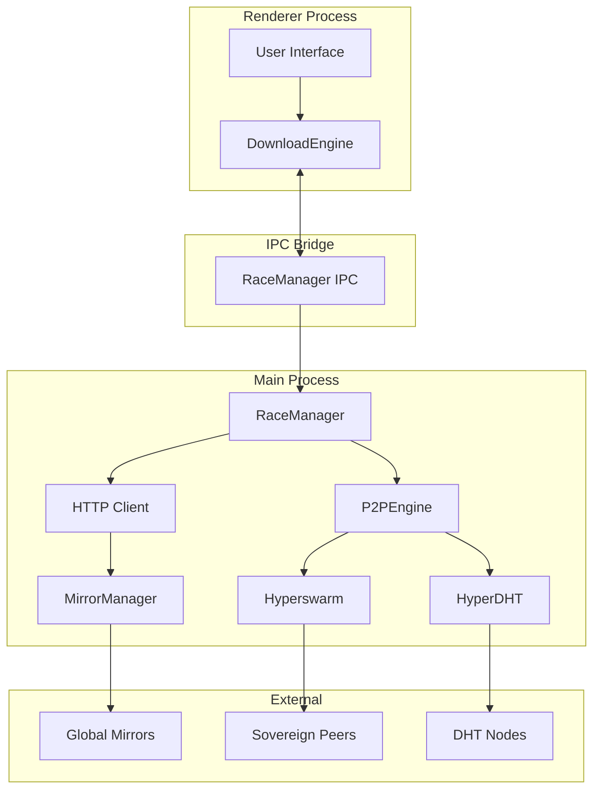

# Helios Launcher Architecture Overview

The Helios Launcher is built on Electron, leveraging a multi-process architecture to separate concerns between user interface (Renderer) and core system logic (Main).

---

## 1. Process Separation

### Main Process (System & Infrastructure)
The Main process acts as the "Privileged Layer". It has direct access to the Node.js filesystem, native networking (UDX/UTP), and OS-level operations.
- **P2PEngine**: Manages the Hyperswarm/HyperDHT network.
- **RaceManager**: Orchestrates the racing logic for downloads.
- **MirrorManager**: Ranks and monitors HTTP mirrors.
- **DistributionAPI**: Handles root verification and signature checking.
- **Auto-Updater**: Manages launcher-level updates.

### Renderer Process (UI & User Interaction)
The Renderer process is responsible for the visual state and user experience. It communicates with the Main process via a secure IPC Bridge.
- **UI Components**: Account management, Modpack lists, Settings.
- **DownloadEngine (Client-side)**: Manages the high-level download queue and communicates with `RaceManager` in Main.
- **Sentry Integration**: Telemetry and error reporting.

---

## 2. Networking Stack (The Helios Download System)

The networking stack is designed for high availability and decentralized delivery.

### Data Flow
1. **Request**: The `DownloadEngine` in Renderer requests a file (e.g., a mod jar).
2. **Racing**: `RaceManager` in Main starts two tasks: an HTTP request to the best mirror and a P2P request to the swarm.
3. **Winner**: The first bytes to arrive from either source "win" the race. The other leg is cancelled.
4. **Validation**: As bytes arrive, they are streamed through a hasher. If the final hash doesn't match the distribution index, the file is rejected.
5. **Atomic Write**: Files are written to `.tmp` and only renamed to their final path once verified.

---

## 3. Security Model

- **Root of Trust**: All modpack metadata (`distribution.json`) is cryptographically signed via **Ed25519**. The launcher will not boot unsigned distributions unless explicitly overridden in dev mode.
- **Sandbox**: The P2P system uses a strict whitelist for file sharing, preventing access to sensitive user data.
- **Hardened IPC**: No direct Node.js access is exposed to the Renderer. All system calls are mediated by the IPC bridge with parameter validation.

---

## 4. Key Directory Structure

| Path | Description |
| :--- | :--- |
| `app/assets/js/core/` | Core business logic (Auth, Distro, Config). |
| `network/` | Main process networking stack (P2P, Racing, Mirrors). |
| `electron/` | Electron entry points and IPC handlers. |
| `docs/` | Technical documentation and specifications. |
