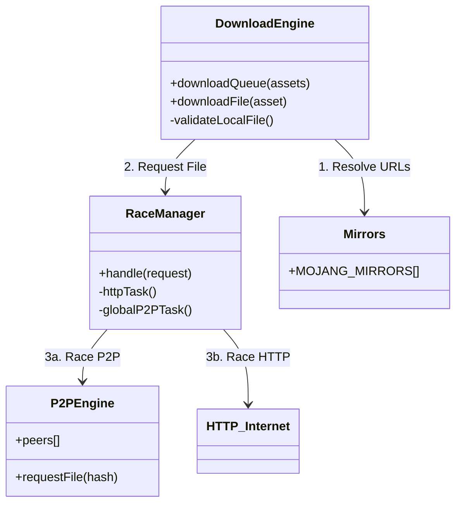
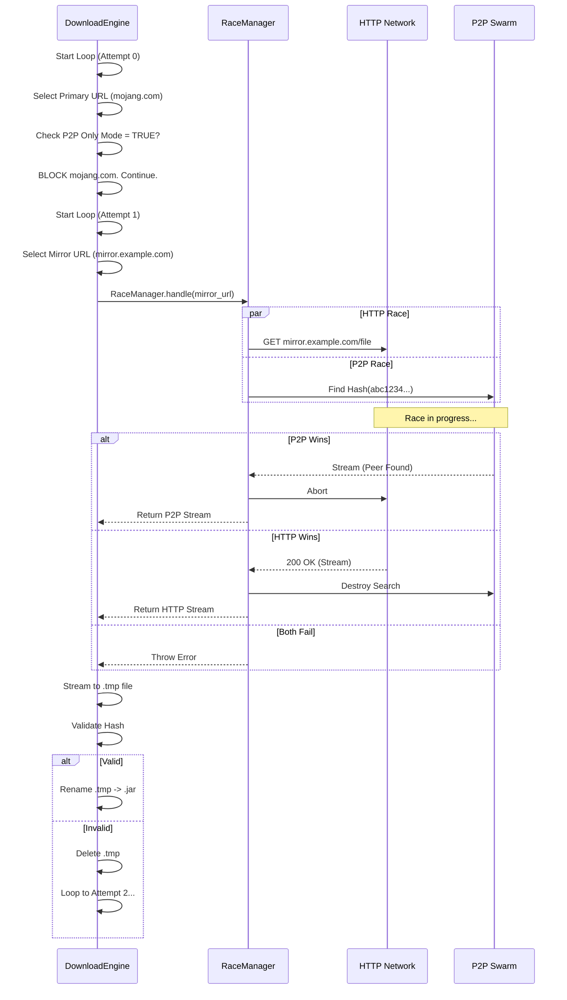

# Launcher Download System Architecture

This document provides a comprehensive technical breakdown of the Helios Launcher's download subsystem. It covers the exact sequences of operations, error handling state machines, race conditions, and security enforcement mechanisms.

---

## 1. System Architecture Diagram

The download system operates in layers, from the high-level orchestrator (`DownloadEngine`) to the low-level network transport (`RaceManager` & `P2PEngine`).

---

## 2. The Orchestrator: `DownloadEngine.js`

The engine does not simply download files one by one. It uses a **Two-Pass "Deferral" Strategy** to ensure maximum reliability and speed.

### Phase 1: The Main Pass (Optimistic)
*   **Concurrency**: Dynamic (8-32 parallel downloads). Real-time throttling based on System CPU usage and Network Health.
*   **Behavior**: Tries to download every file in the queue.
*   **Failure Handling**: If a file fails (after internal retries), it is **NOT** thrown effectively immediately. Instead, it is pushed to a `deferredQueue`.
    *   *Why?* A single slow/failing file shouldn't block the other 500 files from finishing.

### Phase 2: The "Final Stand" (Pessimistic)
*   **Trigger**: Runs only if `deferredQueue` is not empty after Phase 1.
*   **Concurrency**: Reduced to **4** (to reduce network congestion).
*   **Behavior**: Retries the failed files with **Force HTTP** enabled (`X-Skip-P2P: true`).
*   **Logic**: "P2P failed us, mirrors failed us, let's try a direct, slow, reliable connection one last time."

### Phase 3: Critical Failure
*   If `deferredQueue` is *still* not empty after Phase 2, the launcher throws a `Critical failure`, aborting the update.

---

## 3. The Retry Loop (Per-File State Machine)

For *each* file attempt (inside `downloadFile`), the following state machine executes:

**Inputs**: `Asset { url, hash, size, fallbackUrls[] }`

1.  **Pre-Validation**:
    *   Check for `.tmp` file (delete if exists).
    *   Check destination file. If exists: `Hash(file) == asset.hash`?
    *   **True**: Return immediately (Skip).

2.  **Candidate Selection**:
    *   Build list: `[Primary URL, Mirror 1, Mirror 2, ...]`
    *   *Note*: Mirrors are populated by `MojangIndexProcessor` from `config.js`.

3.  **The Loop (Max 5 Attempts)**:
    *   **Attempt matches Candidate**: `url = candidates[attempt % length]` (Round Robin).
    *   **P2P Only Mode Check**:
        *   If `p2pOnlyMode == true`:
        *   Check `url.hostname`. If ends with `mojang.com` or `minecraft.net` -> **SKIP** (continue loop).
        *   *Result*: Only Mirrors and Custom Servers are allowed.

    *   **Force HTTP Logic**:
        *   If `attempt >= 2` (3rd try) OR `Final Stand` mode:
        *   Set header `X-Skip-P2P: true`.
        *   *Why?* If P2P hasn't found it by now, it likely won't. Fallback to direct HTTP.

    *   **Execution**: Call `RaceManager.handle(request)`.

    *   **Atomic Write & Verify**:
        *   Stream data to `filename.tmp`.
        *   **Verify**: `Hash(filename.tmp) == asset.hash`.
        *   **Success**: `fs.rename(.tmp -> .ext)`. Return.
        *   **Failure**: Delete `.tmp`. Throw Error.

---

## 4. The Race Manager (Under the Hood)

This is the "Black Box" that decides *how* to get the bytes. It uses `Promise.any()` to race two promises:

### A. The HTTP Task
*   Standard `fetch(url)`.
*   **Blocker**: If `p2pOnlyMode` is on AND the URL is official, this task rejects immediately.

### B. The Global P2P Task (Hyperswarm)
*   **Lookup**: Queries the DHT (Distributed Hash Table) for the **SHA1** or **SHA256** of the file.
*   **Connection**: Uses UTP (UDP-based) hole-punching to connect to peers.
*   **Timeout**: 60 seconds (Soft). If no first byte within 60s, this task rejects.
*   **Overload Protection**: If `P2PEngine` is "overloaded" (too many active streams), this task rejects immediately.

### The Win Condition
*   **Winner**: The first task to resolve with a `ReadableStream`.
*   **Loser**: Is immediately `aborted` / `destroyed`.
*   **Consistency**: The data is piped through a `HashVerifierStream` (Pass-through stream that calculates hash on the fly).

---

## 5. Sequence Diagram: A Failed Download Handling

How the system handles a file that Mojang is blocking, but a Mirror has.

## 6. Error Codes & Debugging

If you see these errors in `main.log`:

*   **"HTTP Blocked: P2P Only Mode is Enabled"**:
    *   RaceManager blocked a request because `settings.delivery.p2pOnly` is ON, effectively protecting you from connecting to Mojang.
*   **"Validation failed"**:
    *   The file downloaded, but the Hash did not match `distribution.json`.
    *   *Cause*: Corrupted mirror file, MITM attack, or disk error.
    *   *System Action*: File deleted. Retried.
*   **"Critical failure: Failed to download X files"**:
    *   All 5 attempts failed (Primary, Mirrors) AND the Final Stand failed.
    *   *Check*: Internet connection, config mirrors.
    *   *Observation*: Console will show a table of failed files. Sentry receives a structured report with retry history for the first 20 failed files.

---

## 7. Error Analytics (Message & Sentry)

When a **Critical Failure** occurs, the engine aggregates the failure history of all failed files into a single error object.

### Console Output
The console displays a clean summary to avoid flooding:
*   Total failure count.
*   `console.table` preview of the first 10 failures.
*   "...and X more" if necessary.

### Sentry Report
Sentry receives a `captureException` event with `extra.downloadDebug` **ONLY** for unexpected software errors.

**Strict Smart Filtering**:
To avoid noise, the system **IGNORES** errors related to:
*   **Network**: 404, 502, Timeouts, DNS resolution, Connection Refused.
*   **Environment**: Disk Full (ENOSPC), Permission Denied (EPERM), File Locked (EBUSY).
*   **Data Integrity**: Validation Failed / Hash Mismatch (Treated as potential network corruption).

**Reported Errors**:
*   Internal Logic Errors (e.g., `ReferenceError`, `TypeError`).
*   Unknown/Unhandled system errors.

**Payload Structure**:
*   `failedCount`: Total number of failed files.
*   `failures`: Array of up to 20 failed file objects, each containing:
    *   `id`: Asset ID.
    *   `url`: Last attempted URL.
    *   `history`: Array of attempts (Method, URL, Error).
*   `truncated`: Boolean, true if more than 20 files failed.

---

## 8. Security Measures

The Helios Launcher implements a multilayered security model designed to operate safely in a trustless P2P environment.

### A. Data Integrity & Validation
1.  **Mandatory Hash Verification**:
    *   Every file downloaded (via HTTP or P2P) is piped through a `HashVerifierStream`.
    *   The SHA1/SHA256 hash is calculated on-the-fly.
    *   If the calculated hash does not match the manifest (from `distribution.json`), the file is immediately discarded and the error `Validation failed` is thrown.
2.  **Atomic Writes**:
    *   Files are never written directly to their destination. They are streamed to a `.tmp` file first.
    *   Only *after* the hash is verified is the file renamed to its final extension.
    *   This prevents corrupted or malicious partial files from existing in the game directories.

### B. P2P Network Security (Hyperswarm)
1.  **Request ID Randomization**:
    *   Each P2P request generates a cryptographically random 4-byte ID.
    *   This prevents ID collision attacks and spoofing.
2.  **Peer Validation**:
    *   **Strict Input Sanitization**: Malformed JSON or invalid buffer types from peers are silently dropped.
    *   **Size Caps (Infinite Stream Protection)**: The engine enforces a strict size limit (`ExpectedSize + 1MB Tolerance`). If a peer sends more data than expected, the stream is cut, and the peer is penalized.
3.  **DoS Protection**:
    *   **Queue Limits**: The `serverQueue` is capped at 500 requests to prevent memory exhaustion attacks.
    *   **Request Maps**: The internal active request map is hard-capped to prevent object injection or memory leaks.
4.  **Reputation System**:
    *   **Penalty/Strike System**: Peers sending bad data, timing out excessively, or violating protocol rules receive "Strikes".
    *   **Blacklisting**: 3 Strikes result in a temporary ban (10 minutes) from the swarm.
    *   **Circuit Breaker (Panic Mode)**: If the client detects a coordinated attack (global error rate spikes), it triggers a "Panic Mode," disabling P2P entirely for 5 minutes.

### C. Privacy & Isolation
1.  **P2P Only Mode**:
    *   When enabled, the `RaceManager` explicitly blocks connections to `mojang.com` and `minecraft.net`.
    *   This prevents the official Mojang API from receiving your IP (except for authentication, which is handled separately).
2.  **Local Peer Discovery**:
    *   Local (LAN) peers are prioritized but treated with the same validation rules as global peers.
    *   IPs are sanitized (e.g., IPv6 mapping removed) before processing.

