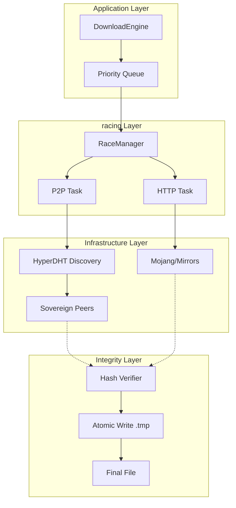
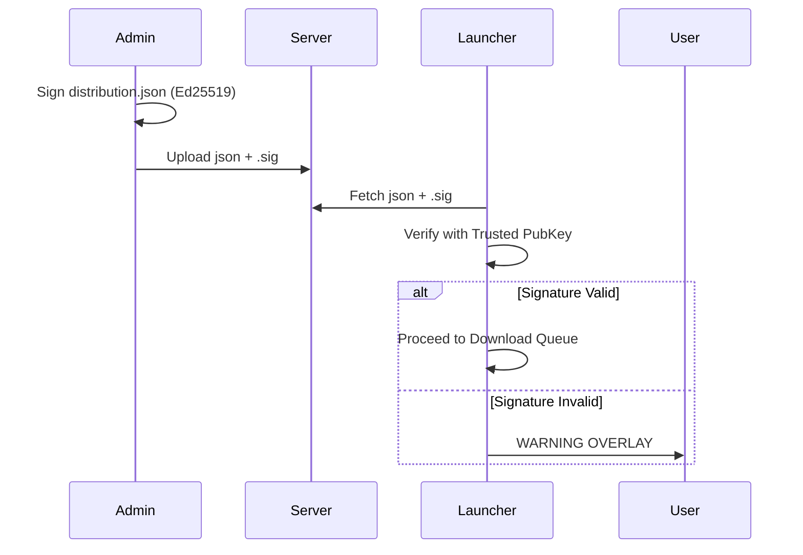
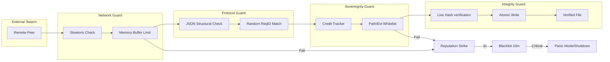

# Helios Download System (HDS) Technical Specification

This document provides a deep technical analysis of the Helios Launcher's download subsystem. Designed for high availability, security, and sovereignty, the system combines **P2P Swarming**, **HTTP Racing**, and **Cryptographic Verification** via Ed25519.

---

## 1. High-Level Architecture

The HDS is a multi-layered system that prioritizes decentralized delivery while maintaining absolute data integrity.

### Component Map
*   **DownloadEngine**: The high-level orchestrator. Manages the queue, retries, and file system atomicity.
*   **RaceManager**: The "Racing" logic. It simultaneously attempts to fetch data via P2P and HTTP, picking the fastest winner.
*   **P2PEngine**: The P2P backbone. Powered by **Hyperswarm** and **HyperDHT**, it manages the sovereign peer network.
*   **DistributionAPI**: Handles the root of trust, verifying the `distribution.json` index via **Ed25519 signatures**.

### The Racing Philosophy
Instead of "P2P or HTTP", HDS uses both. When a file request starts, two tasks are born:
1.  **HTTP Task**: Fetches from Primary or Mirror.
2.  **P2P Task**: Seeks the hash in the swarm.

The first task to verify the first few kilobytes of data wins. The loser is immediately aborted to save bandwidth.

---

## 2. P2P Protocol Specification

The P2P network operates on a custom binary protocol over UTP (UDP) connections.

### 2.1 Handshake & Identification
Upon connection, peers exchange a `MSG_HELLO` (0x05) packet:
*   **Remote Weight**: An integer (0-255) representing the peer's performance and trust level.
*   **Capabilities**: A bitmask for feature support (e.g., Bit 0 for **Batching**).

### 2.2 Packet Format
Every packet starts with a **9-byte header**:
*   `[0]` - **Type** (1 byte)
*   `[1-4]` - **RequestID** (4 bytes, Big-Endian)
*   `[5-8]` - **Length** (4 bytes, Big-Endian)

| Type | Hex | Name | Payload |
| :--- | :--- | :--- | :--- |
| 1 | 0x01 | `MSG_REQUEST` | Hash string or JSON `{h, p, id}` |
| 2 | 0x02 | `MSG_DATA` | Binary file chunk |
| 3 | 0x03 | `MSG_ERROR` | UTF-8 Error Message |
| 4 | 0x04 | `MSG_END` | Null (Signals EOF) |
| 5 | 0x05 | `MSG_HELLO` | Internal Handshake data |
| 8 | 0x08 | `MSG_BATCH` | Array of RequestIDs and Hashes |

### 2.3 Discovery Hub (Hyperswarm)
The system joins a **Sovereign Swarm** topic derived from a secret seed (`SWARM_TOPIC_SEED`).
- **DHT (Distributed Hash Table)**: Used for global peer discovery across the internet.
- **MDNS**: Used for zero-latency local discovery in LAN environments.
- **Persistence**: Successful peers are stored in `peers.json` for "pre-warming" future sessions.

---

## 3. Security & Integrity Root

Cryptographic trust is built from the top down.

### 3.1 Ed25519 Distribution Signing
The root `distribution.json` must be signed by the administrator.
- **Signer**: Uses a private Ed25519 key to generate a signature of the JSON content.
- **Verifier**: The launcher contains a whitelist of `DISTRO_PUB_KEYS`.
- **Flow**:
    1.  Downloads `distribution.json`.
    2.  Downloads `distribution.json.sig`.
    3.  Wraps its local Public Key in **SPKI DER** format.
    4.  Verifies the signature. If it fails, an **Interactive Overlay** prevents launch unless overridden.

### 3.2 File Validation Chain
Once the distribution index is trusted, every file is protected:
1.  **Immutable Identity**: Files are identified by their SHA1/SHA256 hash.
2.  **Streaming Verification**: The `DownloadEngine` pipes every download through a native crypto hasher.
3.  **Atomic Rename**: Files are written as `.tmp`. If the final hash check fails, the `.tmp` is destroyed. The file system only sees valid completions.

---

## 4. Resilience & Error States

### 4.1 The Deferral State Machine
To handle flaky mirrors or P2P bottlenecks, the engine uses a non-blocking queue:

1.  **Round 1**: All tasks start. Failed tasks go to a **Deferred Queue**.
2.  **Round 2**: Deferred tasks are retried with **Force HTTP** and higher priority.
3.  **Round 3**: Critical Failure. If fallback URLs and P2P both fail, the launch halts.

### 4.2 Circuit Breaker (Anti-DoS)
The P2P Engine monitors its own health:
*   **Panic Mode**: If the P2P failure rate exceeds a critical threshold, the engine disables the swarm for 5 minutes.
*   **Strike System**: Malicious peers (sending bad hashes or infinite streams) are blacklisted by IP and Public Key.

---

## 5. Privacy & Sovereignty

### 5.1 P2P Only Mode
When enabled, the `RaceManager` acts as a privacy firewall:
- **Rule**: If a URL belongs to `*.mojang.com` or `*.minecraft.net`, it is **REJECTED**.
- **Result**: The launcher *only* talks to peers or configured mirrors, preventing Mojang from tracing the user's IP for game file metadata.

### 5.2 Mirror Fallbacks
Mirroring is robust. If a primary asset URL is blocked, the `MojangIndexProcessor` dynamically swaps the base URL with a mirror from `config.js` while maintaining the hash integrity.

---

## 6. Key Files for Reference

| File | Role |
| :--- | :--- |
| `DownloadEngine.js` | Main entry point, queue management, validation. |
| `RaceManager.js` | HTTP vs P2P racing logic. |
| `P2PEngine.js` | Hyperswarm/DHT lifecycle and peer management. |
| `PeerHandler.js` | P2P Binary protocol implementation and packet parsing. |
| `MojangIndexProcessor.js` | Mojang metadata resolution (Versions/Assets/Index). |
| `DistributionAPI.js` | HTTP API for distribution index and Ed25519 verification. |
| `config.js` | Infrastructure settings (Bootstrap nodes, PubKeys). |

---

## 7. Security Hardening & Defense in Depth

The Helios Launcher implements a "Defense in Depth" strategy, where multiple independent layers of security protect the system even if one layer is compromised.

### 7.1 Protocol & Network Hardening (P2P)

The P2P transport layer (`PeerHandler.js` & `P2PEngine.js`) contains several low-level guards against malicious network behavior.

#### A. Anti-Slowloris (Inactivity Guard)
Malicious peers might open connections and keep them open by sending data extremely slowly (1 byte/sec), eventually exhausting server resources.
*   **Socket Timeouts**: Every peer socket is hard-capped with a **30s timeout**.
*   **Minimum Speed Enforcement**: During active transfers, the seeder monitors the download speed. If a client remains below **1KB/s** for more than 10s, the connection is forcibly severed.

#### B. Memory Exhaustion Protection (DoS Guard)
To prevent peers from crashing the launcher, strict resource limits are applied:
*   **Buffer Caps**: Incoming data chunks are never buffered beyond **2MB**. If a message exceeds this, the connection is dropped.
*   **JSON Sanitization**: JSON payloads (used for metadata requests) are capped at **1KB** and must pass a **Structural Depth Check** (no nested objects allowed) to prevent `JSON.parse` from consuming excessive CPU.

#### C. Request Masking & Spoofing Prevention
*   **ReqID Randomization**: Instead of sequential IDs, every request uses a cryptographically random **4-byte ID**.
*   **Peer-Binding**: Responses are only accepted if the `RequestID` matches an active request **and** the sender matches the originally queried peer. This prevents "blind injection" attacks.

### 7.2 File System & RCE Protection

Protecting the client's file system is critical to prevent Remote Code Execution (RCE).

#### A. The Whitelist/Blacklist Model
The launcher enforces a strict path-based sandbox for P2P sharing:
*   **Whitelisted Folders**: Only specified directories (e.g., `assets`, `libraries`, `versions`, `minecraft`) can be read from or written to via P2P.
*   **Extension Blacklist**: Sensitive file types like `.enc`, `.dat`, `.log`, and `.txt` (which might contain session info or keys) are explicitly **denied** from the swarm.
*   **Directory Traversal Guard**: All relative paths are normalized and checked. Any path containing `..` or leading to an absolute location outside the data directory is instantly rejected.

#### B. Transactional Integrity (Atomic Writes)
Files are never written directly to the game folders. They follow a transactional flow:
1.  **Download to `.tmp`**: File is streamed to a temporary extension.
2.  **On-the-Fly Hashing**: A `HashVerifierStream` calculates the checksum as the bytes arrive.
3.  **Final Commitment**: Only if `FinalHash == ManifestHash` is the file renamed (`fs.rename`) to its proper location.
*   *Security Benefit*: Malicious or partial files never "exist" as valid game components, preventing the launcher from ever loading corrupted code.

### 7.3 Sybil Attack & Reputation Management

A Sybil attack occurs when one person creates thousands of fake peers to control the swarm.

*   **Ed25519 PeerIDs**: Every peer is identified by the public key of their Hyperswarm connection. This provides a stable, unforgeable ID that persists across sessions.
*   **Credit System (Fair Usage)**: The `UsageTracker` manages virtual credits for every peer based on their transfer history.
    *   **Consumption**: Downloading from the launcher consumes credits.
    *   **Regeneration**: Credits regenerate slowly over time.
    *   **Soft-Ban**: Peers who "leech" too much are soft-banned until they regenerate enough credits, ensuring the swarm remains balanced.
*   **Strike & Blacklist System**:
    *   Peers violating protocol rules receive a "Strike".
    *   **3 Strikes = Blacklist**: The ID is banned for 10 minutes.
*   **Global Circuit Breaker (Panic Mode)**: If the system detects a massive, coordinated attack (e.g., 5+ security violations in 1 minute), it triggers a global "Panic Mode," disabling P2P functionality entirely to protect the user's infrastructure.

### The Security Chain Diagram

---

## 8. Bandwidth & Fairness Mechanisms

The Helios Launcher employs a sophisticated traffic shaping system to ensure the P2P network remains healthy and does not impact the user's primary internet activities.

### 8.1 Dynamic Upload Limits
The system automatically adjusts upload bandwidth based on the user's network capacity and system load.

| Mode | Limit | Activation Criteria |
| :--- | :--- | :--- |
| **Safe Mode** | **5 Mbps** | Default state. Activated if system load is high (>80%) or network speed is unknown. |
| **Boost Mode** | **15 Mbps** | Activated ONLY if:  1. Download speed > **10 MB/s**  2. CPU Load < 80%  3. Hardware Profile is `MID` or `HIGH` |
| **LAN Mode** | **Unlimited** | No limits are applied to local network peers (detected via IP range). |

### 8.2 Peer Quality Requirements (The "Strike" System)
To maintain high swarm velocity, "dead weight" peers are aggressively pruned.

*   **Minimum Speed Threshold**: **125 KB/s** (128,000 bytes/s).
    *   *Mechanism*: A watchdog samples speed every 15s.
    *   *Penalty*: Peers below this threshold receive a **Strike**.
    *   *Consequence*: **3 Strikes** (45s of poor performance) results in disconnection.
*   **Connection Timeout**: **30 seconds**.
    *   *Defense*: Prevents *Slowloris* attacks where a peer connects but sends no data.
*   **Inactivity Check**: **45 seconds**.
    *   *Defense*: Cleans up "zombie" connections that are technically open but stalling.

### 8.3 Seeder Health Consensus (Self-Healing)
The system distinguishes between "Bad Peers" and "Bad Self". If the launcher detects it is the bottleneck, it self-isolates to protect the swarm's health score.

*   **Consensus Check**: Every 30s, the engine evaluates all active upload peers (min 3 witnesses).
*   **Failure Condition**: If **100%** of active peers are downloading slower than **125 KB/s**.
*   **Action**:
    1.  **Self-Strike**: Increments internal counter.
    2.  **3 Self-Strikes**: Triggers **Passive Mode** (Self-Isolation).
    3.  **Duration**: 1 Hour. During this time, the launcher stops announcing itself as a seeder.

### 8.4 Global Concurrency Scaling
The `DownloadEngine` scales the number of parallel download threads based on CPU pressure to prevent UI freezing.

*   **Baseline**: 8 Threads.
*   **Max Scaling**: Up to 32 Threads.
*   **Logic**:
    *   `CPU < 50%` -> **32 Threads**
    *   `CPU > 50%` -> **24 Threads**
    *   `CPU > 70%` -> **16 Threads**
    *   `CPU > 90%` -> **8 Threads** (Critical fallback)

### 8.5 Credit System (Token Bucket)
A virtual economy ensures fairness and prevents "Leeching" (downloading without sharing).

*   **Model**: Token Bucket Algorithm.
*   **Bucket Size**: **5,000 Credits** (5 GB).
*   **Cost**: **1 Credit = 1 MB** downloaded.
*   **Regeneration**:
    *   **Rate**: **0.5 Credits/sec** (~30 MB/min).
    *   **Passive Input**: Just staying online regenerates credits.
    *   **Active Input**: Uploading to others regenerates credits faster (1:1 ratio).
*   **Bankruptcy**: If credits hit 0, the peer is deprioritized or "soft-banned" until they regenerate enough credits to prove they are good citizens.

---

## 9. Key Files for Reference

| File | Role |
| :--- | :--- |
| `DownloadEngine.js` | Main entry point, queue management, validation. |
| `RaceManager.js` | HTTP vs P2P racing logic and P2P Only Mode firewall. |
| `P2PEngine.js` | Hyperswarm lifecycle, credits, and global circuit breaker. |
| `PeerHandler.js` | P2P Binary protocol, packet parsing, and security guards. |
| `MojangIndexProcessor.js` | Mojang metadata resolution and mirror fallback logic. |
| `DistributionAPI.js` | Distribution index API and Ed25519 root verification. |
| `config.js` | Infrastructure settings (Bootstrap nodes, Trusted PubKeys). |
