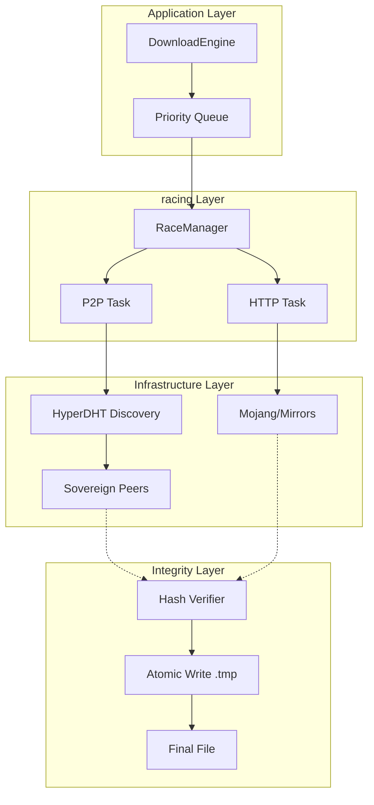
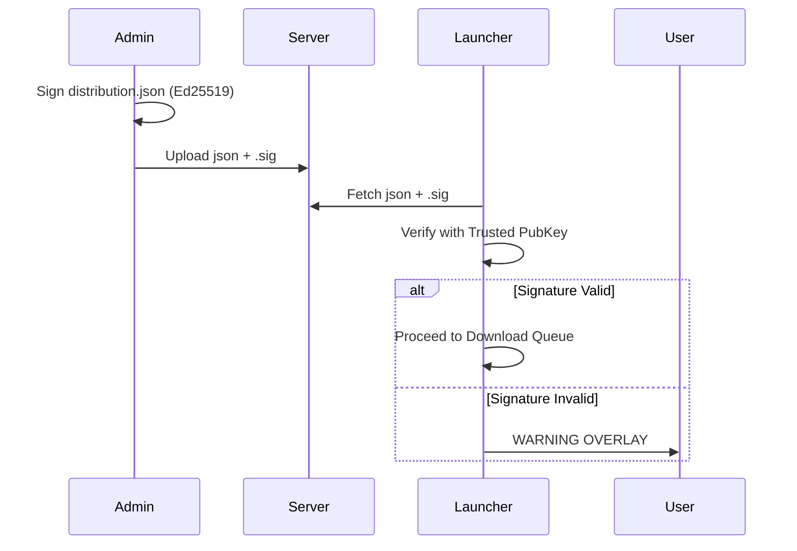
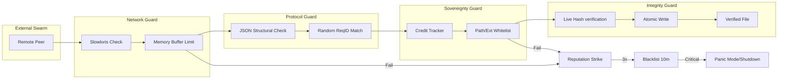

# Helios Download System (HDS) Technical Specification

This document provides a deep technical analysis of the Helios Launcher's download subsystem. Designed for high availability, security, and sovereignty, the system combines **P2P Swarming**, **HTTP Racing**, and **Cryptographic Verification** via Ed25519.

---

## 1. High-Level Architecture

The HDS is a multi-layered system that prioritizes decentralized delivery while maintaining absolute data integrity.

### Component Map
*   **DownloadEngine**: The high-level orchestrator. Manages the queue, retries, and file system atomicity.
*   **RaceManager**: The "Racing" logic. It simultaneously attempts to fetch data via P2P and HTTP, picking the fastest winner.
*   **P2PEngine**: The P2P backbone. Powered by **Hyperswarm** and **HyperDHT**, it manages the sovereign peer network.
*   **MirrorManager**: Handles ranking and health checks for configured HTTP mirrors based on latency and reliability.
*   **StatsManager**: Records session and global transfer statistics to persistent storage.
*   **DistributionAPI**: Handles the root of trust, verifying the `distribution.json` index via **Ed25519 signatures**.

Instead of "P2P or HTTP", HDS uses both. When a file request starts, two tasks are born:
1.  **HTTP Task**: Fetches from the highest-ranked mirror according to `MirrorManager`.
2.  **P2P Task**: Seeks the hash in the swarm via `P2PEngine`.

The first task to verify the first few kilobytes of data (the "first chunk") wins. The loser is immediately aborted to save bandwidth.

### Fail-Fast Logic
The `RaceManager` employs a fail-fast mechanism. If one leg (e.g., P2P) fails immediately (e.g., no peers found), it doesn't wait for a timeout and instead allows the other leg to proceed as the primary source. If both legs fail, the request is moved to the **Deferred Queue**.

```mermaid
graph TD
    subgraph "Application Layer"
        DE[DownloadEngine] --> PQ[Priority Queue]
    end
    
    subgraph "racing Layer"
        PQ --> RM[RaceManager]
        RM --> HTTP[HTTP Task]
        RM --> P2P[P2P Task]
    end
    
    subgraph "Infrastructure Layer"
        HTTP --> MOJ[Mojang/Mirrors]
        P2P --> HDHT[HyperDHT Discovery]
        HDHT --> Peers[Sovereign Peers]
    end
    
    subgraph "Integrity Layer"
        Peers -.-> HV[Hash Verifier]
        MOJ -.-> HV
        HV --> AW[Atomic Write .tmp]
        AW --> FS[Final File]
    end
```

---

## 2. P2P Protocol Specification

The P2P network operates on a custom binary protocol over UTP (UDP) connections.

### 2.1 Handshake & Identification
Upon connection, peers exchange a `MSG_HELLO` (0x05) packet:
*   **Remote Weight**: An integer (0-255) representing the peer's performance and trust level.
*   **Capabilities**: A bitmask for feature support (e.g., Bit 0 for **Batching**).

### 2.2 Packet Format
Every packet starts with a **9-byte header**:
*   `[0]` - **Type** (1 byte)
*   `[1-4]` - **RequestID** (4 bytes, Big-Endian)
*   `[5-8]` - **Length** (4 bytes, Big-Endian)

| Type | Hex | Name | Payload |
| :--- | :--- | :--- | :--- |
| 1 | 0x01 | `MSG_REQUEST` | Hash string or JSON `{h, p, id}` |
| 2 | 0x02 | `MSG_DATA` | Binary file chunk |
| 3 | 0x03 | `MSG_ERROR` | UTF-8 Error Message |
| 4 | 0x04 | `MSG_END` | Null (Signals EOF) |
| 5 | 0x05 | `MSG_HELLO` | Internal Handshake data |
| 6 | 0x06 | `MSG_PING` | Null (Keep-alive) |
| 7 | 0x07 | `MSG_PONG` | Null (Keep-alive Response) |
| 8 | 0x08 | `MSG_BATCH` | Array of `[ReqID, Hash]` |

### 2.3 Traffic Segmentation (LAN vs WAN)
The system distinguishes between **Local (LAN)** and **Global (WAN)** peers via IP range analysis.
- **LAN Peers**: Bypass most rate limits and quotas for maximum internal speed.
- **WAN Peers**: Subject to strict AIMD rate limiting and Fair Usage credit tracking.

### 2.4 Hardware Profiles
P2P performance is governed by the user's selected hardware profile:
- **LOW**: Seeding (upload) is disabled to save resources.
- **MID**: Upload limit is capped at 5 Mbps.
- **HIGH**: Full adaptive bandwidth allowed (up to user settings).

### 2.5 Discovery Hub (Hyperswarm)
The system joins a **Sovereign Swarm** topic derived from a secret seed (`SWARM_TOPIC_SEED`).
- **DHT (Distributed Hash Table)**: Used for global peer discovery across the internet.
- **MDNS**: Used for zero-latency local discovery in LAN environments.
- **Persistence**: Successful peers are stored in `peers.json` for "pre-warming" future sessions.

---

## 3. Security & Integrity Root

Cryptographic trust is built from the top down.

### 3.1 Ed25519 Distribution Signing
The root `distribution.json` must be signed by the administrator.
- **Signer**: Uses a private Ed25519 key to generate a signature of the JSON content.
- **Verifier**: The launcher contains a whitelist of `DISTRO_PUB_KEYS`.
- **Flow**:
    1.  Downloads `distribution.json`.
    2.  Downloads `distribution.json.sig`.
    3.  Wraps its local Public Key in **SPKI DER** format.
    4.  **Verifies the signature**. If it fails, an **Interactive Overlay** prevents launch unless overridden.
    5.  **Anti-Replay Check**: The launcher extracts the `timestamp` field. If `remote.timestamp < local.timestamp`, the update is rejected as a **Replay Attack** (downgrade attempt).
    6.  **P2P Size Guard**: For security and resource fairness, any file larger than **200 MB** is automatically excluded from the P2P network and downloaded via HTTP only.

### 3.2 Main-Renderer IPC Separation
To prevent application-wide lag and "bus clogging":
*   **Main Process Exclusive Writing**: The Main process handles all network requests (HTTP/P2P) and direct file system operations.
*   **Progress-Only Events**: The Renderer never receives raw binary data or download chunks. It only receives high-level events (e.g., `5% downloaded`, `Speed: 10 MB/s`) to update the UI. This ensures zero serialization overhead for large assets.

### 3.3 Atomic Write & OS Resilience
HeliosLauncher uses a hardened commit flow to handle OS-level interference (like Antivirus locks):
1.  **Stage to `.tmp`**: Files are downloaded and verified in a temporary file.
2.  **Validation**: Post-download hash verification ensures integrity.
3.  **Resilient Commit**: If the file is valid, the launcher uses an **Atomic Rename** with a built-in retry mechanism (exponential backoff) to bypass transient `EPERM` or `EBUSY` errors caused by real-time scanners (common on Windows).
1.  **Immutable Identity**: Files are identified by their SHA1/SHA256 hash.
2.  **Streaming Verification**: The `DownloadEngine` pipes every download through a native crypto hasher.
3.  **Mandatory Seeder Check**: Before seeding a file to others, the launcher recalculates the hash from disk to prevent poisoning.
4.  **Symlink Traversal Protection**: All paths are resolved to their `realpath` to prevent symlinks from pointing outside the whitelisted directories.
5.  **Atomic Rename**: Files are written as `.tmp`. If the final hash check fails, the `.tmp` is destroyed.

```mermaid
sequenceDiagram
    participant Admin
    participant Server
    participant Launcher
    
    Admin->>Admin: Sign distribution.json (Ed25519)
    Admin->>Server: Upload json + .sig
    Launcher->>Server: Fetch json + .sig
    Launcher->>Launcher: Verify with Trusted PubKey
    alt Signature Valid
        Launcher->>Launcher: Proceed to Download Queue
    else Signature Invalid
        Launcher->>User: WARNING OVERLAY
    end
```

---

## 4. Resilience & Error States

### 4.1 The Deferral State Machine
To handle flaky mirrors or P2P bottlenecks, the engine uses a non-blocking queue:

1.  **Round 1**: All tasks start. Failed tasks go to a **Deferred Queue**.
2.  **Round 2**: Deferred tasks are retried with **Force HTTP** and higher priority.
3.  **Round 3**: Critical Failure. If fallback URLs and P2P both fail, the launch halts.

### 4.2 Circuit Breaker (Anti-DoS)
The P2P Engine monitors its own health:
*   **Panic Mode**: If the P2P failure rate exceeds a critical threshold, the engine disables the swarm for 5 minutes.
*   **Strike System**: Malicious peers (sending bad hashes or infinite streams) are blacklisted by IP and Public Key.

---

## 5. Privacy & Sovereignty

### 5.1 P2P Only Mode
When enabled, the `RaceManager` acts as a privacy firewall:
- **Rule**: If a URL belongs to `*.mojang.com` or `*.minecraft.net`, it is **REJECTED**.
- **Result**: The launcher *only* talks to peers or configured mirrors, preventing Mojang from tracing the user's IP for game file metadata.

### 5.2 Mirror Fallbacks
Mirroring is robust. If a primary asset URL is blocked, the `MojangIndexProcessor` dynamically swaps the base URL with a mirror from `config.js` while maintaining the hash integrity.

---

| `DistributionAPI.js` | HTTP API for distribution index and Ed25519 verification. |
| `config.js` | Infrastructure settings (Bootstrap nodes, PubKeys). |

---

## 7. Security Hardening & Defense in Depth

The Helios Launcher implements a "Defense in Depth" strategy, where multiple independent layers of security protect the system even if one layer is compromised.

### 7.1 Protocol & Network Hardening (P2P)

The P2P transport layer (`PeerHandler.js` & `P2PEngine.js`) contains several low-level guards against malicious network behavior.

#### A. Anti-Slowloris (Inactivity Guard)
Malicious peers might open connections and keep them open by sending data extremely slowly (1 byte/sec), eventually exhausting server resources.
*   **Socket Timeouts**: Every peer socket is hard-capped with a **30s timeout**.
*   **Minimum Speed Enforcement**: During active transfers, the seeder monitors the download speed. If a client remains below **1KB/s** for more than 10s, the connection is forcibly severed.

#### B. Memory Exhaustion Protection (DoS Guard)
To prevent peers from crashing the launcher, strict resource limits are applied:
*   **Buffer Caps**: Incoming data chunks are never buffered beyond **2MB**. If a message exceeds this, the connection is dropped.
*   **JSON Sanitization**: JSON payloads (used for metadata requests) are capped at **1KB** and must pass a **Structural Depth Check** (no nested objects allowed) to prevent `JSON.parse` from consuming excessive CPU.

#### C. Request Masking & Spoofing Prevention
*   **ReqID Randomization**: Instead of sequential IDs, every request uses a cryptographically random **4-byte ID**.
*   **Peer-Binding**: Responses are only accepted if the `RequestID` matches an active request **and** the sender matches the originally queried peer. This prevents "blind injection" attacks.
*   **Credit Reservation**: To prevent "Race to Drain" attacks where a peer requests a massive amount of data before their credits are checked, credits are **reserved** at the start of the request and only refunded if the request fails early.

### 7.2 File System & RCE Protection

Protecting the client's file system is critical to prevent Remote Code Execution (RCE).

#### A. The Whitelist/Blacklist Model
The launcher enforces a strict path-based sandbox for P2P sharing:
*   **Whitelisted Folders**: Only specified directories (e.g., `assets`, `libraries`, `versions`, `minecraft`) can be read from or written to via P2P.
*   **Extension Blacklist**: Sensitive file types like `.enc`, `.dat`, `.log`, and `.txt` (which might contain session info or keys) are explicitly **denied** from the swarm.
*   **Directory Traversal Guard**: All relative paths are normalized and checked. Any path containing `..` or leading to an absolute location outside the data directory is instantly rejected.

#### B. Transactional Integrity (Atomic Writes)
Files are never written directly to the game folders. They follow a transactional flow:
1.  **Download to `.tmp`**: File is streamed to a temporary extension.
2.  **On-the-Fly Hashing**: A `HashVerifierStream` calculates the checksum as the bytes arrive.
3.  **Final Commitment**: Only if `FinalHash == ManifestHash` is the file renamed (`fs.rename`) to its proper location.
*   *Security Benefit*: Malicious or partial files never "exist" as valid game components, preventing the launcher from ever loading corrupted code.

### 7.3 Sybil Attack & Reputation Management

A Sybil attack occurs when one person creates thousands of fake peers to control the swarm.

*   **Ed25519 PeerIDs**: Every peer is identified by the public key of their Hyperswarm connection. This provides a stable, unforgeable ID that persists across sessions.
*   **Credit System (Fair Usage)**: The `UsageTracker` manages virtual credits for every peer based on their transfer history.
    *   **Consumption**: Downloading from the launcher consumes credits.
    *   **Regeneration**: Credits regenerate slowly over time.
    *   **Soft-Ban**: Peers who "leech" too much are soft-banned until they regenerate enough credits, ensuring the swarm remains balanced.
*   **Strike & Blacklist System**:
    *   Peers violating protocol rules receive a "Strike".
    *   **3 Strikes = Blacklist**: The ID is banned for 10 minutes.
*   **Global Circuit Breaker (Panic Mode)**: If the system detects a massive, coordinated attack (e.g., 5+ security violations in 1 minute), it triggers a global "Panic Mode," disabling P2P functionality entirely to protect the user's infrastructure.

### 7.4 Anti-Replay Protection (Timestamp Guard)
To prevent attackers from serving old, signed but vulnerable configurations:
*   **Mandatory Timestamps**: `distribution.json` includes a cryptographic-bound `timestamp`.
*   **Monotonic Enforcement**: The launcher stores the last seen timestamp. Any new distribution must have a timestamp **greater than or equal to** the stored one.
*   **Downgrade Prevention**: This prevents an attacker from reverting the launcher to an old state where security patches (e.g. library hashes) were not yet applied.

### The Security Chain Diagram

```mermaid
graph LR
    subgraph "External Swarm"
        Peer[Remote Peer]
    end

    subgraph "Network Guard"
        Peer --> SL[Slowloris Check]
        SL --> MB[Memory Buffer Limit]
    end

    subgraph "Protocol Guard"
        MB --> JS[JSON Structural Check]
        JS --> RA[Random ReqID Match]
    end

    subgraph "Sovereignty Guard"
        RA --> CT[Credit Tracker]
        CT --> WS[Path/Ext Whitelist]
    end

    subgraph "Integrity Guard"
        WS --> HV[Live Hash verification]
        HV --> AW[Atomic Write]
        AW --> OK[Verified File]
    end
    
    MB -- Fail --> Strike[Reputation Strike]
    WS -- Fail --> Strike
    Strike -- 3x --> BL[Blacklist 10m]
    BL -- Critical --> PM[Panic Mode/Shutdown]
```

---

## 8. Resilience & Self-Healing

The HDS is designed to survive network instability and malicious interference automatically.

### 8.1 The "Consensus of Failure" (The Doctor)
If the launcher is uploading to multiple peers and **all** of them report extremely low speeds (<125 KB/s), the launcher assumes it is the bottleneck (e.g., local ISP throttling or CPU exhaustion).
- **Action**: The launcher enters **Passive Mode** for 1 hour, stopping its own announcements as a seeder to preserve system resources and prevent "poisoning" the swarm with a slow source.

### 8.2 Network Interface Monitor
The `P2PEngine` continuously monitors the OS network interfaces. If an IP change or a new interface is detected (e.g., VPN toggle), the entire P2P swarm is gracefully restarted to bind to the new correct network path.

### 8.3 Circuit Breaker (Panic Mode)
If more than 5 security violations (e.g., bad hashes, path traversal attempts) are detected within 1 minute, a global **Panic Mode** is triggered. P2P is disabled entirely for 5 minutes, forcing the launcher to use trusted HTTP mirrors only.

---

## 9. Bandwidth & Fairness Mechanisms

The Helios Launcher employs a sophisticated traffic shaping system to ensure the P2P network remains healthy and does not impact the user's primary internet activities.

### 9.1 Dynamic Upload Limits
The system automatically adjusts upload bandwidth based on the user's network capacity and system load.

| Mode | Limit | Activation Criteria |
| :--- | :--- | :--- |
| **Safe Mode** | **5 Mbps** | Default state. Activated if system load is high (>80%) or network speed is unknown. |
| **Boost Mode** | **15 Mbps** | Activated ONLY if:  1. Download speed > **10 MB/s**  2. CPU Load < 80%  3. Hardware Profile is `MID` or `HIGH` |
| **LAN Mode** | **Unlimited** | No limits are applied to local network peers (detected via IP range). |

### 9.2 Adaptive Bandwidth (AIMD & Slow Start)
The upload rate is managed by an **AIMD (Additive Increase, Multiplicative Decrease)** algorithm:
- **Slow Start**: When starting, the limit doubles every 10 seconds until the first sign of congestion.
- **Additive Increase**: After the first congestion, the limit increases by **1 Mbps** every 30 seconds.
- **Multiplicative Decrease**: If congestion is detected, the limit is instantly cut by **50%**.

### 9.3 Congestion Detection (Median RTT)
Congestion is detected by monitoring the **Round Trip Time (RTT)** of all WAN peers.
- **Metric**: The system calculates the **Median Delta** between the current RTT and the baseline (minimum) RTT.
- **Threshold**: If the Median Delta exceeds **150ms**, the network is considered congested, and a "Backoff" is triggered.

### 9.4 Peer Quality Requirements (The "Strike" System)
To maintain high swarm velocity, "dead weight" peers are aggressively pruned.

*   **Minimum Speed Threshold**: **125 KB/s** (128,000 bytes/s).
    *   *Mechanism*: A watchdog samples speed every 15s.
    *   *Penalty*: Peers below this threshold receive a **Strike**.
    *   *Consequence*: **3 Strikes** (45s of poor performance) results in disconnection.
*   **Connection Timeout**: **30 seconds**.
    *   *Defense*: Prevents *Slowloris* attacks where a peer connects but sends no data.
*   **Inactivity Check**: **45 seconds**.
    *   *Defense*: Cleans up "zombie" connections that are technically open but stalling.

### 9.5 Seeder Health Consensus (Self-Healing)
The system distinguishes between "Bad Peers" and "Bad Self". If the launcher detects it is the bottleneck, it self-isolates to protect the swarm's health score.

*   **Consensus Check**: Every 30s, the engine evaluates all active upload peers (min 3 witnesses).
*   **Failure Condition**: If **100%** of active peers are downloading slower than **125 KB/s**.
*   **Action**:
    1.  **Self-Strike**: Increments internal counter.
    2.  **3 Self-Strikes**: Triggers **Passive Mode** (Self-Isolation).
    3.  **Duration**: 1 Hour. During this time, the launcher stops announcing itself as a seeder.

### 9.6 Global Concurrency Scaling
The `DownloadEngine` scales the number of parallel download threads based on CPU pressure to prevent UI freezing.

*   **Baseline**: 8 Threads.
*   **Max Scaling**: Up to 32 Threads.
*   **Logic**:
    *   `CPU < 50%` -> **32 Threads**
    *   `CPU > 50%` -> **24 Threads**
    *   `CPU > 70%` -> **16 Threads**
    *   `CPU > 90%` -> **8 Threads** (Critical fallback)

### 9.7 Credit System (Token Bucket)
A virtual economy ensures fairness and prevents "Leeching" (downloading without sharing).

*   **Model**: Token Bucket Algorithm.
*   **Bucket Size**: **5,000 Credits** (5 GB).
*   **Cost**: **1 Credit = 1 MB** downloaded.
*   **Regeneration**:
    *   **Rate**: **0.5 Credits/sec** (~30 MB/min).
    *   **Passive Input**: Just staying online regenerates credits.
    *   **Active Input**: Uploading to others regenerates credits faster (1:1 ratio).
*   **Bankruptcy**: If credits hit 0, the peer is deprioritized or "soft-banned" until they regenerate enough credits to prove they are good citizens.

### 9.8 I/O Throttling (Hardware Protection)
To prevent the launcher from locking up systems with slow mechanical drives (HDD):
*   **Write Slot Limit**: While the launcher may open up to 32 network connections, it strictly limits concurrent disk write operations (e.g., `MAX_CONCURRENT_WRITES = 16`).
*   **Backpressure**: When the write limit is reached, the `DownloadEngine` pauses new network requests until existing buffers are flushed to disk, preventing OS-level I/O queue congestion.

---

## 10. Key Files for Reference

| File | Role |
| :--- | :--- |
| `DownloadEngine.js` | Main entry point, queue management, validation. |
| `RaceManager.js` | HTTP vs P2P racing logic and P2P Only Mode firewall. |
| `P2PEngine.js` | Hyperswarm lifecycle, credits, and global circuit breaker. |
| `PeerHandler.js` | P2P Binary protocol, packet parsing, and security guards. |
| `MojangIndexProcessor.js` | Mojang metadata resolution and mirror fallback logic. |
| `DistributionAPI.js` | Distribution index API and Ed25519 root verification. |
| `config.js` | Infrastructure settings (Bootstrap nodes, Trusted PubKeys). |
